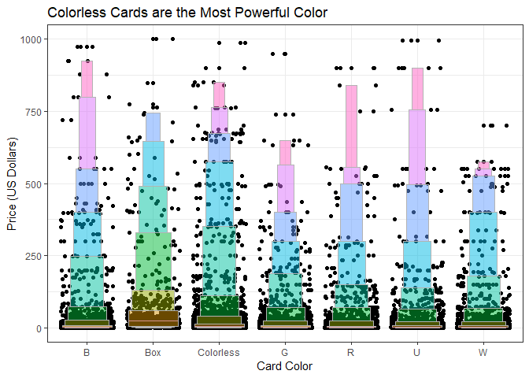
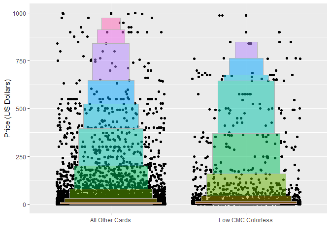

## Background

  I became concerned with buying Magic the Gathering cards when I was about 14. I have since wanted to know what makes a card 'good' in the Magic community since I had trouble understanding why some cards, though they seemed powerful, were unplayable while others, with seemingly unextraordinary attributes (Black Lotus, any of the Moxes, Time Stop, etc.) were worth many thousands of dollars and banned in all formats possible. Even as I got older I was still perplexed concerning the hidden utility of certain cards whose value mere moments before seemed nearly worthless became obvious in the hands of adroit players. I searched for answers for many years while playing, staying awake in bed many nights studying cards that could potentially make my Magic deck better, to find no intuitive correlation, and no way to predetermine, which cards were excellent until they had been played many times over by professionals or personal experience. 
  Finally, by R Programming, I believe I have the tools to answer my question on how to predict the power of a card by card attributes alone. I have had a hunch since I began playing Magic that Converted Mana Cost (CMC) might be the indicator, especially considering that the majority of the most powerful cards unanimously agreed on by the Magic community (The Power 9 as they are affectionately herlded) have low converted mana costs (7 with a CMC of 0, 1 of 1, and 1 of 3 respecively) and all of which brandish a price tag in the range of $2,000 to $100,000 each. Since price seems to be the best indicator of the efficacy of a card, I will use that as an indicator of overall power to decide which attributes make the 'best' cards. 


```r
library(mosaic)
library(tidyverse)
library(lvplot)
```

# Introduction

The first task before me was to find data that had all of the diverse attributes of the thousands of cards organized in a useful manner. This was found relatively easily as a JSON file on mtgjson.com. The troule was converting the JSON file to a readable format, which ended up being a huge list, then converting that into a tibble that then could be subsetted. I accomplished this by creating a function that replaced any attributes that were missing from individual cards with an 'NA'. Once this was done it was relatively easy to map the function into a dataframe using map_df. 
  Then came the tricky part. Many websites compile data but none of them are willing to share their data easily. Many websites are willing to share only if they have something to profit from it. This meant that I would either have to start a card shop to complete my project or find different means of collecting it myself. I used the rvest package to scrape the data required for this project from mtggoldfish.com. The prices were not comprehensive, only outlining the top 7,000 most valuable cards, but I figured that number was more than enough. 
  The code that I used to accomplish this is outlined in [this](https://github.com/jcorum11/MagicTheGatheringPrices/blob/master/MTGProject/mtg.R) R file. 


```r
all.cards.tidy <- read_rds("C:/git/M335_FA18_Corum_Jaco/data/allCards3.Rds")
```

  From my first experience with scraping data and converting files into something readable I learned that the platitude is true that a data scientist will spend 80% of his time tidying data. I went from base to regex and back trying to figure out how to tidy it up. Finally I formatted it into something useable and Immediately plunged into my hypothesis. 


```r
all.cards.tidy %>% 
  ggplot(
    aes(
      x = cmc, 
      y = price
    )
  ) +
  geom_jitter() +
  geom_smooth(
    aes(alpha = 0.1)
  ) +
  labs(
    title = "Cards With CMC of 4 or Less are the Most Valuable", 
    x = "Converted Mana Cost", 
    y = "Price (US Dollars)"
  ) +
  guides(
    alpha = 'none'
  ) +
  theme_bw()
```

<!-- -->


  This first graphic depicts the card CMC by price. As it is depicted, I am not entirely off base as far as prediction. If we simply look at the average shown by the line there is not much difference in the price range of cards with low CMC versus high CMC. When we look at the distribution, we find that all cards that are highly priced fall within the 1 - 7 CMC range, and only those that are within the 1 - 4 CMC range are astronomically expensive with a few outliers suggesting that the most powerful cards have a Converted mana cost of 4 or less. 


```r
all.cards.tidy %>% 
  filter(!colors %in% NA) %>% 
  ggplot(
    aes(
      x = colors, 
      y = price
    )
  ) +
  geom_jitter() +
  geom_lv(
    aes(
      fill = ..LV..
    ), 
    alpha = 0.5, 
    show.legend = F
  ) +
  labs(
    title = "Colorless Cards are the Most Powerful Color", 
    x = "Card Color", 
    y = "Price (US Dollars)"
  ) +
  theme_bw()
```

<!-- -->


Next I took card prices and compared them with color. I found that the colorless cards have a slightly heavier tail than other colors. This would indicate that someone who buys cards that are colorless have a higher chance of getting a card that is a higher price than other colors. 


```r
all.cards.tidy %>% 
  mutate(
    buy = case_when(
      colors %in% 'Colorless' & cmc <= 4 ~ 'Low CMC Colorless', 
      T ~ 'All Other Cards'
    )
  ) %>% 
  ggplot(
    aes(
      x = buy, 
      y = price
    )
  ) +
  geom_jitter() +
  geom_lv(
    aes(fill = ..LV..), 
    alpha = 0.5, 
    show.legend = F
  ) +
  labs(
    x = ' ',
    y = "Price (US Dollars)"
  )
```

<!-- -->


I then took the prices of all cards that are low CMC and colorless and compared them to all other cards. We see that the tail of low CMC colorless is drastically heavier than all other cards. 


```r
all.cards.tidy %>% 
  filter(!is.na(type.general)) %>% 
  ggplot(
    aes(
      x = type.general, 
      y = price
    )
  ) +
  geom_jitter() + 
  geom_lv(
    aes(
      fill = ..LV..
    ),
    alpha = 0.5, 
    show.legend = F
  ) + 
  labs(
    x = "General Card Type", 
    y = "Price (US Dollars)"
  )
```

<!-- -->

Following the same structure, lv plots show that the distribution tails of lands and artifacts are heavier than all other kinds of cards except for worlds (which is baffling to me).

# conclusion

  The idea that card price can be predicted by attribute of the card is only minimally supported here. To say that every MTG player should only buy colorless cards that are cmc 4 or less would be misleading. There is not a significant difference in the means of these distributions, meaning that one could probably expect to get the same value in randomly a colorless card as they would any other color. The results here only suggest that colorless card that is under 4 cmc that is an artifact, land, or world will be only slightly more likely to be higher priced and therefore slightly more powerful. though there is only a slight difference in the price of these attributes, I do believe that it is no coincidence that most of the cards in the Power 9 are colorless and below 4 converted mana cost. 
  I am going to conduct further analysis on the data to try and find a stronger correlation between price and attribute. I would like to know if there is a subtype that is more powerful. I would also like to know if older cards tend to be more powerful. 


